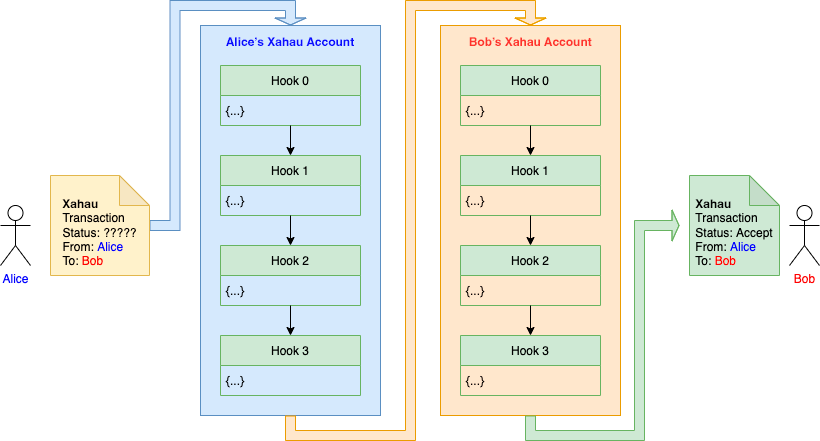

# Chaining

> 👍 Hook Design Philosophy
>
> _Each Hook should do one thing, and do it really well._

### History

In the early days of Hooks it was only possible to install one Hook per account. This meant users were forced to produce omnibus Hooks if they wanted to do more than one thing: for example offset carbon and firewall at the same time.

This was counter to the Hook Design Philosophy, so Hook Chaining was introduced.

### Chaining

A Hook Chain is a sequence of up to **10** Hooks installed on an Xahau account.

* A Hook Chain executes successfully when every Hook in the chain has been individually executed and subsequently calls [accept](../technical/hooks-c-functions/control/accept.md).
* Each chain's execution starts at chain position 0 and ends at chain position 9. If a position is blank (because it was never filled or because the hook that was installed there has been removed) then that position is skipped and treated as successful.
* In order for a transaction to succeed, both ends of the transaction (sending side and receiving side) must have executed successfully. This means if there is a Hook Chain installed on both sides, then both Hook Chains must execute successfully for the transaction to succeed.

Hooks are installed into the chain using the [SetHook Transaction](sethook-transaction.md). When they are installed, the installer may specify install-time [Parameters](parameters.md) which may change the behaviour of the installed Hook.

<figure><figcaption>
Example: Execution flow for a transaction passing through two Hook Chains
</figcaption></figure>

### Chain Manipulation

In addition to the _install-time_ operations specified in the [SetHook Transaction](sethook-transaction.md), Hooks have some runtime control over chain execution:

* A Hook may determine its own `HookHash` by calling [hook\_hash](../technical/hooks-c-functions/hook-context/hook_hash.md).
* A Hook may determine its location in the Hook Chain using [hook\_pos](../technical/hooks-c-functions/hook-context/hook_pos.md).
* A Hook may skip (or re-enable) another Hook further down the chain using [hook\_skip](../technical/hooks-c-functions/hook-context/hook_skip.md).
* A Hook may modify the [Parameters](parameters.md) of a Hook further down the chain using [hook\_param\_set](../technical/hooks-c-functions/hook-context/hook_param_set.md).

### Weak Executions

Hook Chains are [Strongly Executed](weak-and-strong.md). However any Hook in any chain may flag that it requires a second, Weak Execution by calling [hook\_again](../technical/hooks-c-functions/hook-context/hook_again.md). If all Hook Chains execute successfully then the originating transaction is applied. Once the originating transaction has been applied any Weak Executions may happen, in the following order:

1. `cbak` execution if this was an Emitted Transaction.
2. Weak Transactional Stake Holders who have opted in to allow a [Collect Call](collect-call.md). Execution order is first-come first-serve according to the event that caused the TSH to be flagged (such as pathing).
3. Any _Again as Weak_ (AAW) Hooks. Execution order for AAW is first numerically according to Account ID then numerically according to Hook position.
