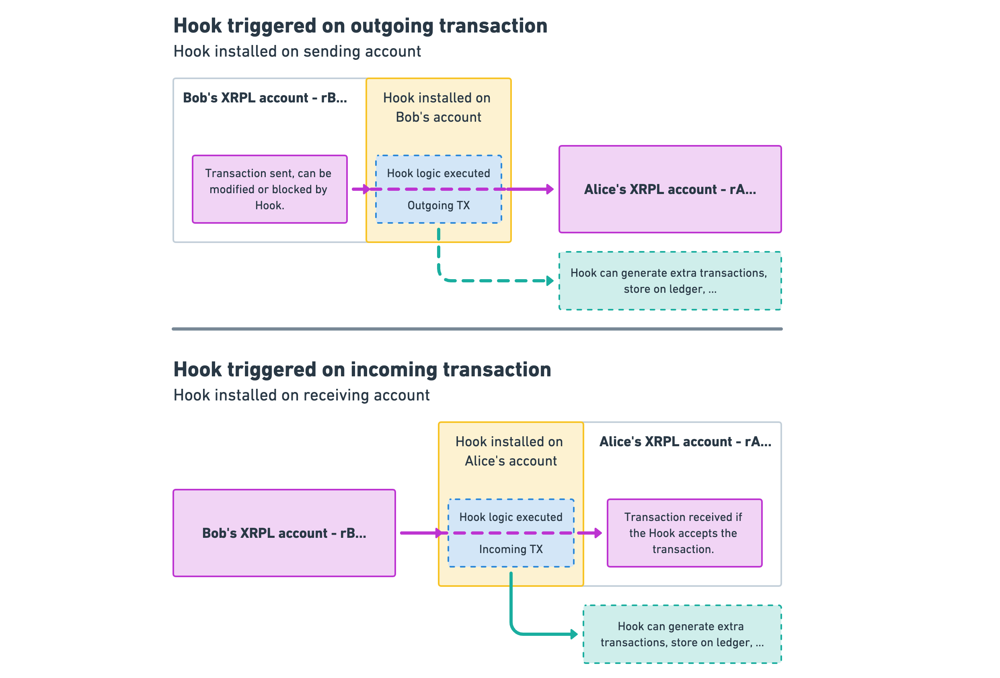

# Introduction

Hooks add smart contract functionality to the Xahau: _layer one_ custom code to influence the behaviour and flow of transactions. Hooks are small, efficient pieces of code being defined on an Xahau account, allowing logic to be executed before and/or after Xahau transactions.


Please note: you're reading the **technical documentation** of Hooks. This documentation is highly technical & assumes prior knowledge of programming and the XRP Ledger. If you are looking for examples on what Hooks are, will bring to the XRP Ledger and what they could do, please [check this page](https://xrpl-hooks.readme.io/docs/examples).


Xahau is known and is being appreciated for its transaction throughput, speed and the low fees. Combined with available advanced transaction types like multi sign, escrows, payment channels and even a decentralized exchange (all on ledger, out of the box, without requiring smart contracts) Xahau has a lot to offer businesses and (creative) developers.

Hooks add smart contract functionality to Xahau: _layer one_ custom code to influence the behaviour and flow of transactions. Hooks are small, efficient pieces of code being defined on an Xahau account, allowing logic to be executed before and/or after Xahau transactions. These Hooks can be really simple, like: “reject payments < 10 XAH”, or “for all outgoing payments, send 10% to my savings account” or more advanced.

<figure><figcaption>
Hooks high level concept
</figcaption></figure>

By allowing Hooks to not only execute efficient logic but also to store small, simple data objects, one could define a Hook like: “for incoming payments transactions, check if the sending account is in a list maintained by another Hook, and if present: reject the transaction”.

Hooks are deliberately not Turing-Complete. While often touted as the holy grail of smart contracts, Turing-Completeness is actually inappropriate for smart contracts. (See [Blog 2](https://dev.to/wietse/hooked-2-hooks-security-smart-contracts-on-the-xrp-ledger-83e).)

Hooks are currently live on a public testnet. It's time for testing, coding, having fun & breaking things, so a future amendment to add Hooks to Xahau livenet can be drafted with confidence.

### Resources

* [Xahau Testnet](https://xahau-test.net/)
* [Xahau Testnet Explorer](https://explorer.xahau-test.net/)
* [Examples (source code)](https://github.com/XRPL-Labs/xrpld-hooks/tree/hooks-ssvm/hook-api-examples)
* [Blogs (concepts)](https://dev.to/t/xrplhooks/top/infinity)
